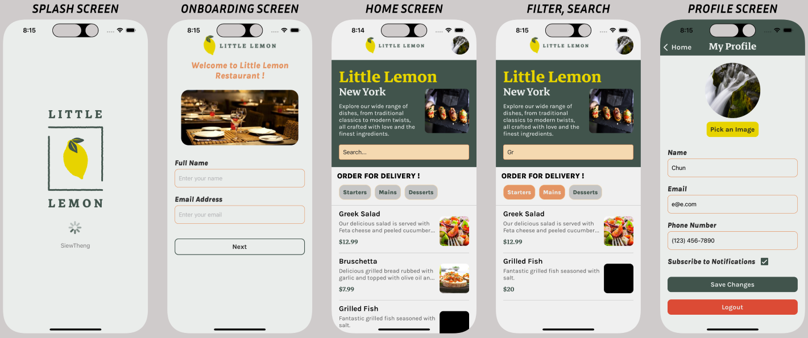

# 🍋 Little Lemon App 🍋

The Little Lemon app allows customers to browse, search, and order food for delivery/pickup from a fictional restaurant. It was built as the capstone project for the Meta React Native Specialization (Coursera).


## Overview 📝
The key features include:
* Account creation
* Browsing menu by category
* Searching for dishes by name
* Customising user profile

## Screenshots 📸



## Tech Stack 💻
* React Native
* Expo
* React Navigation
* React Hooks
* SQLite
* AsyncStorage
* StyleSheet

## Running the Project ▶️
The app can be tested on iOS and Android using expo.
1. Clone the repository
2. Run ```npm install```
3. Run ```npx expo start```

## My Learning Process 🎓
Building this app as the capstone project for the Coursera React Native course was an invaluable learning experience. Here are some key highlights:

### Key Learnings 🗝️
* Applying UX/UI principles to create effective mobile app interfaces and flows using Figma. This included building wireframes, Auto Layout components, variants, and high-fidelity mockups.
* Learned how to build reusable components in Figma and sync them across design files.
* Working with core React Native components like View, Text, Image, ScrollView, FlatList etc. Learned how to style them and build custom reusable components.
* Implementing navigation with React Navigation and configuring stack navigators for moving between app screens.
* Handling app state with React Hooks like useState and useEffect. Persisting state using AsyncStorage.
* Fetching data from remote APIs with the Fetch API .
* Storing data locally with SQLite databases in React Native via Expo-SQLite.
* Using ImagePicker API to allow picking and uploading profile pictures in the app.
* Adding custom fonts and text styles for typographic hierarchy.
* Creating text input validations and using MaskedTextInput for formatted text entries.
* Building forms with text inputs, handling submissions, and input validations.

### Challenges 🚧
* Getting up to speed with React Native specific concepts and libraries. The course content provided a solid foundation but still a learning curve from React web development.
* Implementing best practices for mobile UI and UX design. 

### Future Enhancements 🚀
* Implement account authentication with login
    * Allow users to create accounts and log in using email/password or social media login APIs. This provides secure access to their profile and order history.
* Add items to a persistent cart
    * Enable users to add menu items to a cart that persists between sessions. They can view and edit the cart before checkout.
* Build out dish details pages
    * Individual dish pages could show ingredients, full descriptions, photos, and reviews. Users could add items directly to their cart from these pages.
* Integrate a payment API
    * Process orders by integrating a payment platform like Stripe to accept credit card payments securely within the app.
* Incorporate reservation functionality
    * Allow customers to book and manage upcoming reservations directly through the app interface.
* Implement push notifications
    * Send push notifications to notify users of reservation confirmations, order status updates and special deals.
